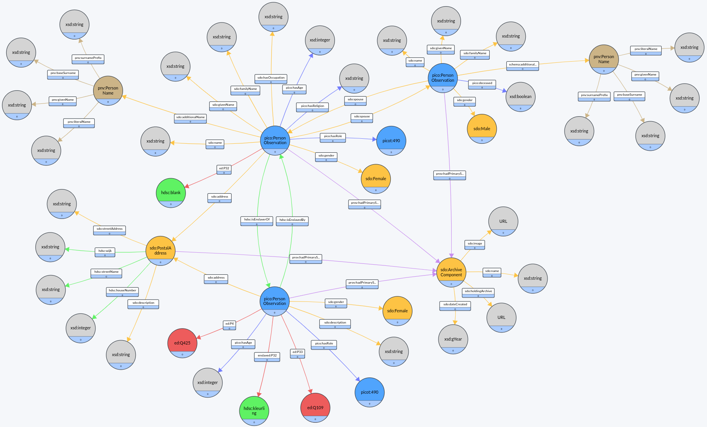
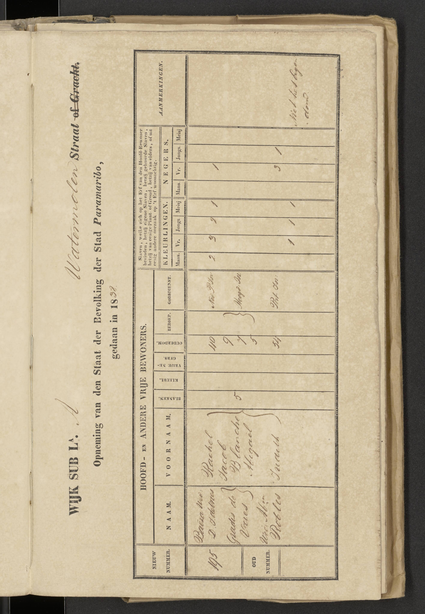

# CSV - TTL conversion script
The R-file transforms the Surinamese ward registers into RDF according to the Persons in Context (PiCo) schema. 

# Data
Source data can be retrieved from: https://hdl.handle.net/10622/VLN8FD

The RDF graph is available at: https://druid.datalegend.net/RJM/Paramaribo-Ward-Registers-1828-1847

# How to cite
Sang-Ajang, J.; Altink, N.; Dikland, P.; Jonkers, C.; Kariomengolo; Valies, C.; Van Oort, T. (2024). Paramaribo Ward Registers 1828-1847. IISH Data Collection. 

# Data model

# Example

