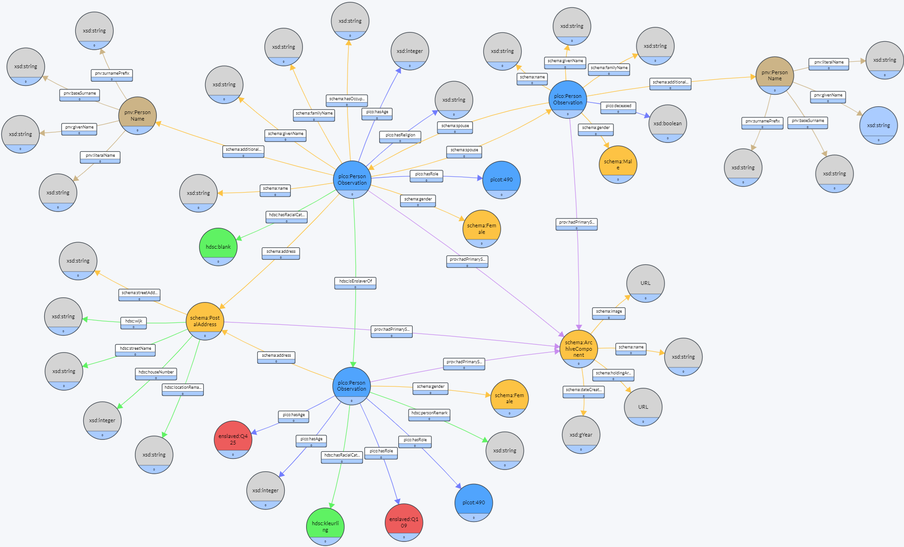
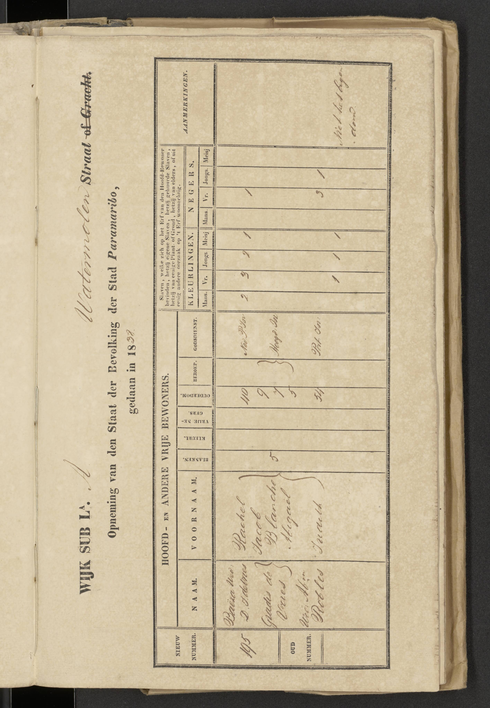

This file transforms the Surinamese ward registers into RDF according to the Persons in Context (PiCO) schema. 

Source data is available from: Sang-Ajang, J.; Altink, N.; Dikland, P.; Jonkers, C.; Kariomengolo; Valies, C.; Van Oort, T. (2024). Paramaribo Ward Registers 1828-1847. IISH Data Collection. https://hdl.handle.net/10622/VLN8FD

